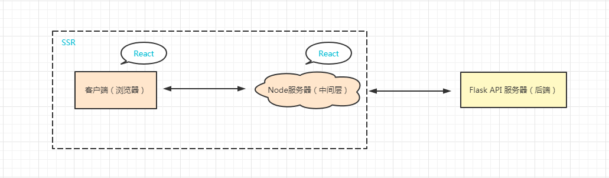
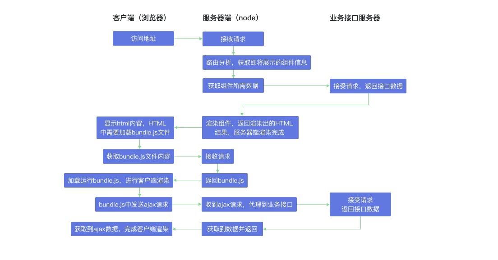

# React-SSR

React服务器端渲染实践


## 项目架构

- 项目架构示意图:



- SSR框架的渲染流程示意图:




## 项目目录说明
1. flask_data_server --> 业务接口服务器后端
2. react_ssr_express_server --> SSR服务器端渲染相关的代码


## 项目运行
```bash
# 克隆项目
$ git clone https://github.com/wtraceback/React-SSR.git

# windows 运行 API 服务器
# 切换至目录
$ cd flask_data_server
# 安装虚拟环境
$ python -m venv venv
# 启动虚拟环境
$ venv\Scripts\activate
# 安装依赖
$ pip install -r requirements.txt
# 运行项目
$ flask run
* Running on http://127.0.0.1:5000/

# windows 运行 React 服务器端渲染
# 打开新的 cmd，切换至目录
$ cd react_ssr_express_server
# 安装项目的全部依赖
$ npm install
或
$ yarn install
# 启动，具体的详情请查看 package.json
$ npm run auto
```

## 参考资料
[React服务器渲染原理解析与实践](https://coding.imooc.com/class/276.html)，学习过程中按照自己的想法在代码上做了很多变动